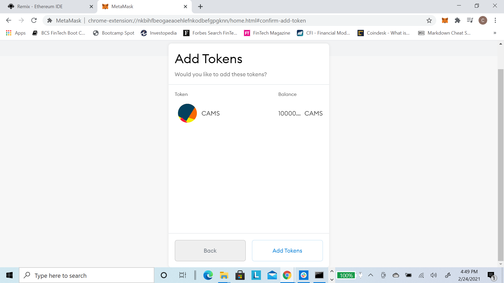

# Solidity - Crowdsale Example

The goal of this repo is deploy a crowdsale of custom tokens using a Solidity Smart Contract.  

To complete this project, the following OpenZeppelin libraries will be utilized: ERC20, ERC20Detailed, ERC20Mintable, Crowdsale, MintedCrowdsale, CappedCrowdsale, TimedCrowdsale, and RefundablePostDeliveryCrowdsale.  All libraries will be required in order to mint the custom token and deploy the crowdsale.  

The PupperCoin.sol smart contract will be used to set the paramaters for the custom token using ERC-20 standards and provide the functions to generate the new custom token as well as define the initial supply of the token. 

The PupperCoinCrowdsale.sol smart contract will leverage the PupperCoin.sol smart contract for the ERC-20 standards and token creation as well as the other OpenZepplin libraries to define the terms of the Crowdsale for the new token. 

The following 4 tools will be used to build the solidity smart contracts and test the Crowdsale for our new token: 

|  | | |  |
|:---:|:---:|:---:|:---:|
| Remix | MetaMask | Ganache | MyCrypto |

# PupperCoin.sol Smart Contract

The PupperCoin.sol smart contract was created to generate the new token using the ERC20 standards.  The contract inherits the ERC20, ERC20Detailed, and ERC20Mintable OpenZepplin smart contracts that are being imported from Github.  The smart contract utilizes the ERC20Detailed constructor, which accepts the following arguments: name, symbol, and decimals.  A decimal amount of 18 is hardcoded in smart contract as Ethereum has an 18 decimal place of precision (i.e. 1 ETH = 10^18 wei).  This contract is later imported into the PupperCoinCrowdsale.sol file, allowing the code and the OpenZepplin smart contracts to be inherited into the PupperCoinCrowdsale.sol smart contract, as needed. 

The constructor for the PupperCoin smart contract is fairly straightforward. It defines the name of the coin/token, gives it a symbol, and sets the initial supply of our new token. After the code is written, we compile the code, to ensure there are no coding errors.

Once confirmed that there are no errors, we can now deploy this smart contract. For this test case, we will use our Local Network to deploy our smart contracts and test the Crowdsale. Once we are satisfied with our code and initial testing, we can then deploy everything to the Ropsten Test Network for further testing.

To deploy the smart contract, we need to define the name, symbol, and initial supply of our new token.
Name: CAMStoken
Symbol: CAMS
Initial Supply: 10 million tokens (i.e. 10000000000000000000000000 - adding in 18 more zero's since our decimal precision is 18).

|| | | 
|:---:|:---:|:---:|
| PupperCoin.sol Deploy | PupperCoin.sol MetaMask confirm | PupperCoin.sol MetaMask confirmation |

| |  |
|:---:|:---:|
| Ganache - PupperCoin.sol - TXN History | Ganache - PupperCoin.sol- TXN Detail |

Once the contract is deployed, we will now need to add the custom token to MetaMask.

# Addng new custom token to MetaMask

Next we will need to add the new custom token to MetaMask. In MetaMask, click on the Assets tab within the wallet address where you deployed the PupperCoin.sol smart contract and then "Add Token". Next,  click on the "Custom Token" tab and enter the smart contract address for the PupperCoin.sol smart contract. Ths should then populate your Token Symbol and Decimals Precision. Click on next and you should now see your newly minted token and the initial supply of 10 million tokens and then click the "Add Tokens" button.

| |  |
|:---:|:---:|
| MetaMask Assets | MetaMask Custom Token |

| |  |
|:---:|:---:|
| MetaMask Add Tokens | MetaMask New Token |

# PupperCoinCrowdsale.sol Smart Contract 

The PupperCoinCrowdsale.sol smart contract can be found in the PupperCoinCrowdsale.sol file.  This contract inherits the OpenZepplin Crowdsale, MintedCrowdsale, CappedCrowdsale, TimedCrowdsale, and RefundablePostDeliveryCrowdsale smart contracts which are imported from Github. All variables defined in the constructor are aligned with variables required to be passed into each inherited crowdsale smart contract's constructor.  No variables were hardcoded in this smart contract, which allows for this smart contract to be reused in the future. We will not be deploying the PupperCoinCrowdsale.sol smart contract. The smart contract we need to deploy is the PupperCoinCrowdsaleDeployer smart contract which is a wrapper and imbedded in the PupperCoinCrowdsale.sol smart contract code.

### PupperCoinCrowdsaleDeployer Smart Contract

The PupperCoinCrowdsaleDeployer smart contract is imbedded in PupperCoinCrowdsale.sol file.  This contract was built to bring all the previous smart contracts together and deploy the crowdsale.  We will deploy the PupperCoinCrowdsaleDeployer smart contract and provide the 3 variables, 2 of which we generated from the PupperCoin.sol smart contract. The name of the token will be provided here ("CAMStoken"), the symbol will be provided ("CAMS"), and the wallet address, i.e. the address where we originally minted the new token, which will be the wallet address collecting all the Ether raised from the crowd sale.  Note, this is the same information we used to deploy the PupperCoin.sol smart contract. 

In the body of the constructor the token_address and token_sale_address variables are defined.  The token_address variable references the PupperCoin contract and generates an address to this token.  The token_sale_address variable references the PupperCoinSale contract and generates an address to the sale.  When defining the sale, the following parameters are set: 
  - Rate of 1, which means 1 token = 1 wei 
  - Wallet Address collecting the token
  - Token sales
  - Start time of now.
  - End time of 24 weeks from now (now + 24 weeks)
  - Goal of 300 (ETH), which matches the cap defined in the exercise provided (i.e. "Homework_Insructions.md"). 
  
Finally, the PupperCoinCrowdsale smart contract is added as the minter and the PupperCoinSaleDeployer smart contract has its minting abilities renounced.  

Now we need to deploy the PupperCoinCrowdsaleDeployer Smart Contract. Once you have deployed the PupperCoinCrowdsaleDeployer Smart Contract, you need to get the token_sale_address and add it into the "At address" button. Then, click the "At address" button and it to deploy your PupperCoinCrowdsale Smart Contract. Once the transaction is confirmed, you will now be able to interact with the PupperCoinCrowdsale Smart Contract.

| |  | 
|:---:|:---:|:---:|
| PupperCoinCrowdsaleDeployer Token Sale Address | PupperCoinCrowdsaleDeployer At Address | PupperCoinCrowdsale Interact Buttons |

### Interacting with the Smart Contracts

The smart contracts will intially be tested on my Local Network. Once the smart contracts are deployed, they can be interacted with to view the token address and token sale address.  As mentioned previously, this is due to the inheritance of the PupperCoin.sol and PupperCoinCrowdsale.sol smart contracts. For testing purposes, I am changing the  close time of the crowd sale to "now + 5 minutes" rather than "now + 24 weeks", so we can test the functionality of finalizing the crowd sale and closing the smart contract.  The 5 minutes will allow me to process the transactions required to reach the 300 cap and then allow me to test the finalize contract function.

Now, let's test participation in the crowdsale by purchasing tokens. As can be viewed below, the number of tokens to be purchased can first be entered in the "Value" box and a wallet address needs to be entered within the contract interaction, "buyTokens" box, which is the wallet address that will be acquiring the tokens.  *NOTE:* The acquiring wallet address needs to be different than the wallet address that was used to deploy the contract as the wallet address from the PupperCoin.sol smart contract will be collecting the ETH from the crowd sale.

Furthermore, the smart contract can be interacted with once the tokens are purchased.  You can view the crowd sale goal, cap, if the goal has been reached, or if the sale is still open, finalized, etc. by clicking on the corresponding buttons.  Once the crowd sale is finalize, and closed, the responses provided by these interactions will change to appropriately reflect the end of the crowdsale. 

| |  |  |
|:---:|:---:|:---:|
| Buying tokens - 1 | Buying tokens - 2 | Buying tokens - 3 |

Below we can see the changes in the smart contract interactions once the sale has been finalized and closed.  This was done for testing and example purposes.  As can be seen below, the crowdsale was first finalized.  Once finalized, the "finalized" interaction then evaluates to true, the "isOpen" interaction evaluates to false, and the "hasClosed" interaction evaluates to true. You can also view and verfy that the goal and cap of 300 (ETH) has been met.  

| |  |  |
|:---:|:---:|:---:|
| Finalizing Sale - 1 | Finalizing Sale - 2 | Finalizing Sale - 3 |

| |  | 
|:---:|:---:|
| Status - 1 | Status - 2 |

# Deploying the Smart Contracts to the Ropsten Test Network

We will now add all the smart contracts to the Ropsten Test Network and deploy them for further testing.  You can simply follow all of the above processes and just change from your Local Network to the Ropsten Test Network in MetaMask and test the same functoinality as well as process the same transactions to interact with the smart contracts. Once you have deployed and tested the smart contracts on the Ropsten Test Network using MetaMask, and are satisfied with the results, you can now use MyCrypto for further testing of the crowd sale.

# Adding Custom Tokens to MyCrypto

Once we have added the custome token in MetaMask on the Ropsten Test Network, we can also add the custom token to MyCrypto as well for testing purposes.  Once in your MyCrypto account, click on "Add Custom Token" under the "Token Balances" section, enter the address of your token, and click "Save".  Once the token is added you will see it populate on your MyCrypto, as shown below. 

Finally, the below screen shots outline an actual transaction on the Ropsten test network.  Due to limited ETH available on the test network, a transaction of 10 wei was made.  This is reflected in the transaction screen shots below, but also means the token value will continue to show 0 due to such a small amount of wei being transacted.  

The screenshot below shows transaction hash details from MyCrypto. 

The screenshot below shows the transaction on Etherscan, which reflects the value of 10 wei transacted.  

**CONGRATULATIONS ON MINTING AND SUCESSFULLY HAVING A CROWDSALE OF YOUR ERC-20 TOKEN!!!**